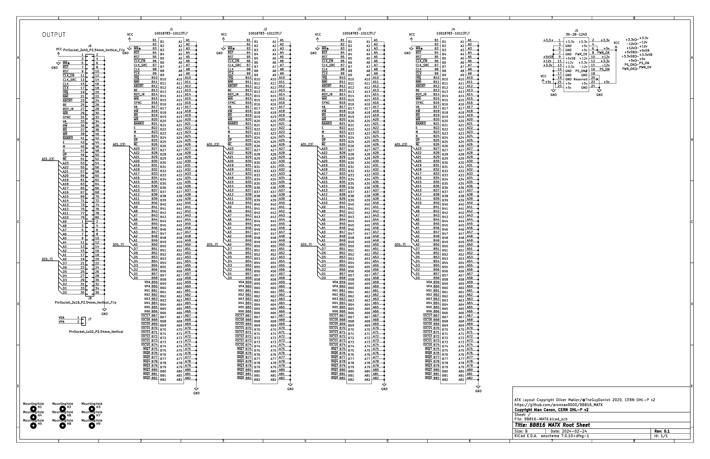
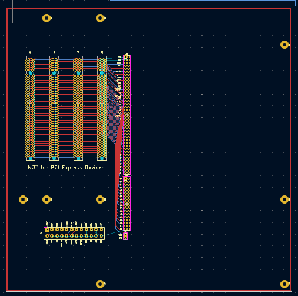
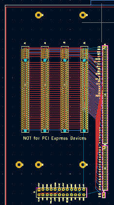

# BB816-MATX

A mATX (Micro-ATX) form factor motherboard for Adrien Kohlbecker's BB816 Breakout Board.

This project adapts an [ATX layout](https://github.com/theguydanish/CM4_MATX) created by Oliver Møller for the (archived) CM4_MATX project.

